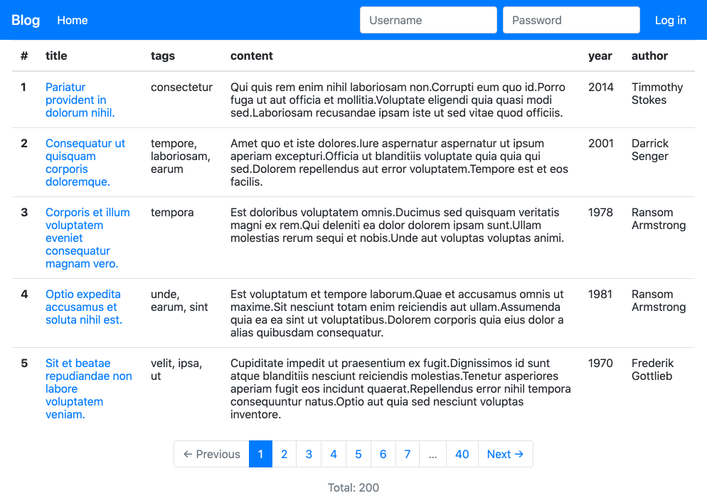
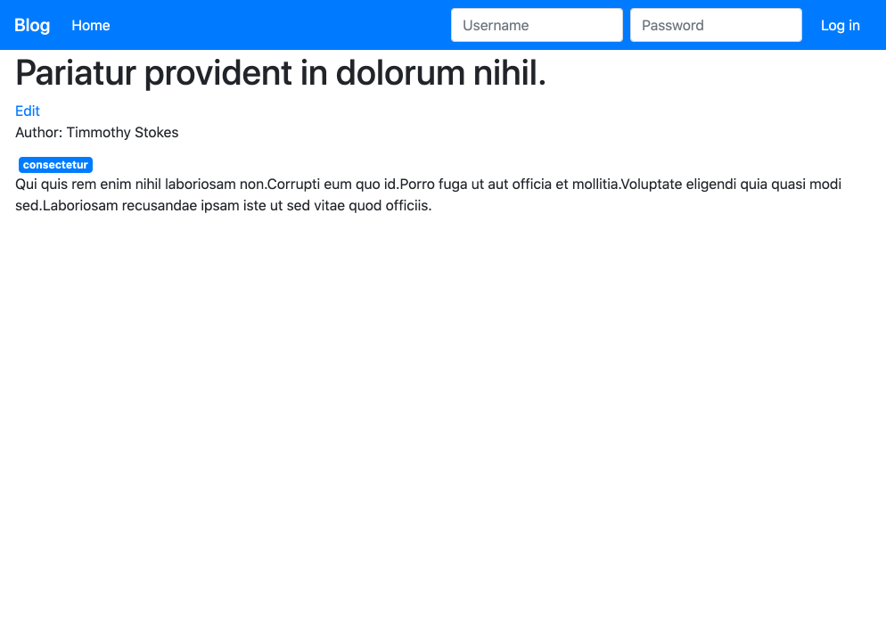
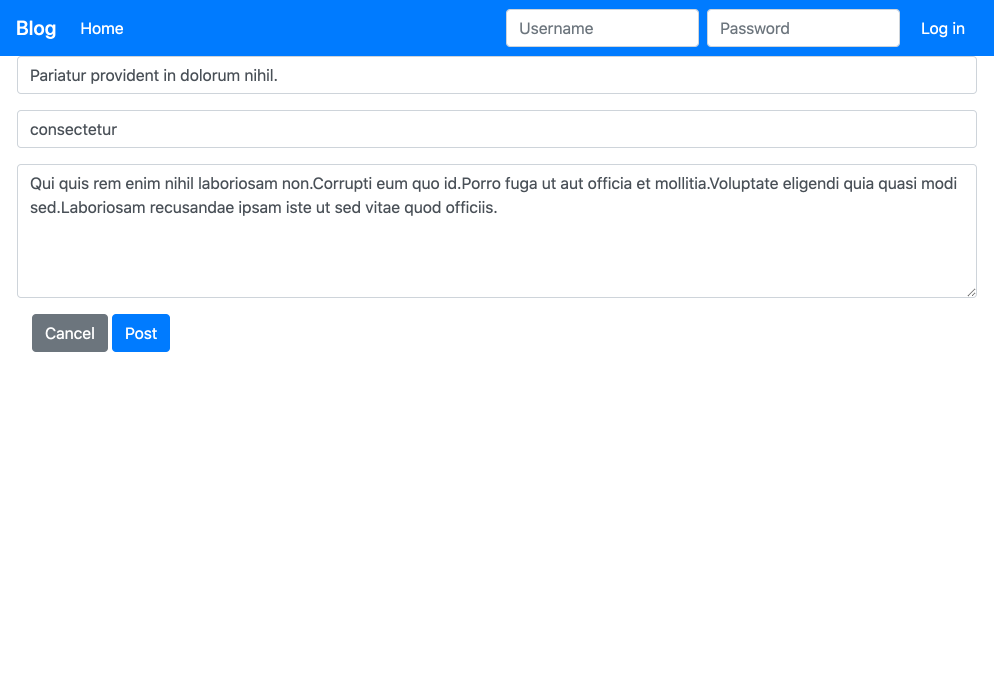

# JavaScriptを使用せずにブログを作る

PHPとフォーム送信のみで、DBにデータを書き込みます。Ajaxを使用しておりません。記事投稿に成功した時などは、リダイレクトバックさせています。

設計はDDDを参考に下記を用意しています。

* Appクラス(E2Eテスト可能にするため)
* ルーティングミドルウェア
  * ログインユーザーの認証(Requestにセットしています)
    * クッキーにログインユーザーのIDを格納
* シングルアクションクラス
* ドメイン層
  * Entity
    * プロパティをValue Objectにせずにスカラ値
    * publicプロパティだがコンスタントDIは強制
  * リポジトリインターフェース
    * 実装クラスはInfrastructure/に置いて分けています
* テスト
  * 具象リポジトリクラスのみ
  
  

## Setup

```
cp .env.example .env
php bin/cmd init:db
cd public
php -S localhost:8000
```

.env.example
```dotenv
APP_ENV="local"

DB_HOST="localhost"
DB_DATABASE="development_db"
DB_USER="root"
DB_PASS="pass"

TEST_DB_HOST="localhost"
TEST_DB_DATABASE="development_test_db"
TEST_DB_USER="root"
TEST_DB_PASS="pass"
```

usersテーブルにアクセスし、passwordカラムを参照して、ログインする。パスワードをハッシュ化していない。

## Screen Shot

### Home(記事一覧)


### 記事閲覧


### 記事投稿

